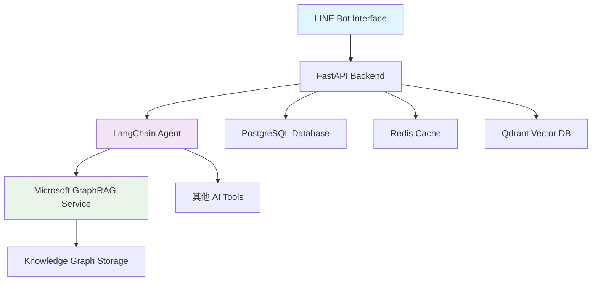

# GraphRAG & LangChain 代理系統 - 技術面試簡報

---

## 📋 目錄

1. [專案概述](#專案概述)
2. [技術架構](#技術架構)
3. [Microsoft GraphRAG 實現](#microsoft-graphrag-實現)
4. [LangChain 代理系統](#langchain-代理系統)
5. [核心功能展示](#核心功能展示)
6. [技術挑戰與解決方案](#技術挑戰與解決方案)
7. [系統安全性](#系統安全性)
8. [性能優化](#性能優化)
9. [未來發展](#未來發展)

---

## 🎯 專案概述

### HealMate - AI 心理健康陪伴機器人

**核心價值主張:**
- 整合專業級 Microsoft GraphRAG 知識圖譜技術
- 基於 LangChain 的智能代理系統
- 提供個性化、有溫度的 AI 陪伴服務

**主要功能:**
- 📚 智能知識圖譜建立與查詢
- 🤖 多工具整合的對話代理
- 🔮 塔羅占卜與情感分析
- 📊 用戶情緒歷史追蹤
- 🌟 星座運勢查詢

---

## 🏗️ 技術架構

### 整體系統架構



### 技術棧

**後端核心:**
- Python 3.11 + FastAPI
- LangChain + Microsoft GraphRAG
- Docker + Docker Compose

**AI & ML:**
- OpenAI GPT-4 / DeepSeek Chat
- Text Embedding Models
- Vector Database (Qdrant)

**數據存儲:**
- PostgreSQL (關係型數據)
- Redis (快取層)
- LanceDB (向量存儲)

---

## 🧠 Microsoft GraphRAG 實現

### 什麼是 GraphRAG？

**傳統 RAG vs GraphRAG:**

| 傳統 RAG | GraphRAG |
|----------|----------|
| 簡單文本檢索 | 知識圖譜結構化 |
| 關鍵詞匹配 | 實體關係分析 |
| 局部資訊 | 全域洞察 |
| 表面語義 | 深層語義理解 |

### 核心實現架構

```python
class MicrosoftGraphRAGService:
    """Microsoft GraphRAG 服務類別"""
    
    async def create_knowledge_base(self, user_id: str, name: str) -> str:
        """建立新的知識庫"""
        kb_id = str(uuid.uuid4())
        kb_path = self.base_path / kb_id
        
        # 建立目錄結構
        self._create_directory_structure(kb_path)
        
        # 使用 graphrag init 建立安全配置
        self._init_graphrag_config(kb_path)
        
        return kb_id
    
    async def index_knowledge_base(self, kb_id: str) -> Dict[str, Any]:
        """建立知識庫索引 - 核心 GraphRAG 處理"""
        env = os.environ.copy()
        env["GRAPHRAG_API_KEY"] = self.openai_api_key
        
        # 執行 GraphRAG 索引建立
        result = subprocess.run([
            "python", "-m", "graphrag", "index",
            "--root", str(kb_path),
            "--verbose"
        ], env=env)
        
        return self._process_indexing_result(result)
```

### GraphRAG 工作流程

#### 1. **文件攝取與預處理**
```python
async def add_document(self, kb_id: str, content: str, filename: str):
    """文件新增與預處理"""
    # 生成唯一文件 ID
    doc_id = str(uuid.uuid4())
    safe_filename = f"{doc_id}_{filename}"
    
    # 儲存到 input 目錄
    file_path = input_dir / safe_filename
    with open(file_path, 'w', encoding='utf-8') as f:
        f.write(content)
```

#### 2. **實體提取與關係分析**
- **實體識別**: 人物、組織、地點、概念
- **關係提取**: 實體間的語義關聯
- **屬性標註**: 實體的詳細描述

#### 3. **社群偵測**
- **層級結構**: 多層級社群組織
- **主題聚類**: 相關概念群組化
- **中心性分析**: 識別關鍵節點

#### 4. **向量嵌入**
- **實體嵌入**: Entity Description Embeddings
- **社群嵌入**: Community Full Content Embeddings
- **文本單元嵌入**: Text Unit Embeddings

### 查詢模式

#### 本地搜尋 (Local Search)
```python
async def query_local(self, kb_id: str, query: str):
    """本地搜尋 - 針對特定實體和關係"""
    result = subprocess.run([
        "python", "-m", "graphrag", "query",
        "--root", str(kb_path),
        "--method", "local",
        "-q", query
    ], env=env)
```
**特點**: 精確、快速、適合特定問題

#### 全域搜尋 (Global Search)
```python
async def query_global(self, kb_id: str, query: str):
    """全域搜尋 - 基於社群分析的整體洞察"""
    result = subprocess.run([
        "python", "-m", "graphrag", "query",
        "--root", str(kb_path),
        "--method", "global",
        "-q", query
    ], env=env)
```
**特點**: 全面、深入、適合複雜分析

---

## 🤖 LangChain 代理系統

### 代理架構設計

```python
class HealMateAgent:
    """HealMate 智能代理"""
    
    def __init__(self):
        self.llm = self._initialize_llm()
        self.tools = self._load_tools()
        self.memory = ConversationBufferWindowMemory(
            memory_key="chat_history",
            return_messages=True,
            k=10
        )
        self.agent = self._create_agent()
    
    def _load_tools(self):
        """載入所有可用工具"""
        return [
            # GraphRAG 工具
            *MICROSOFT_GRAPHRAG_TOOLS,
            
            # 心理健康工具
            strategy_tool,
            emotion_analysis_tool,
            
            # 娛樂工具
            tarot_reading_tool,
            horoscope_tool,
            
            # 記憶工具
            mood_history_tool
        ]
```

### 工具系統設計

#### GraphRAG 工具集

```python
# 1. 知識庫建立工具
create_ms_graphrag_kb_tool = Tool(
    name="CreateMicrosoftGraphRAGKnowledgeBase",
    description="""當用戶想要建立專業的知識圖譜時使用。
    適用於包含「建立知識圖譜」、「GraphRAG」等關鍵詞的請求。""",
    coroutine=_create_knowledge_base_tool,
)

# 2. 智能查詢工具
query_ms_graphrag_tool = Tool(
    name="QueryMicrosoftGraphRAG",
    description="""當用戶想要基於知識圖譜進行深度查詢時使用。
    適用於需要複雜推理和社群分析的問題。""",
    coroutine=_query_graphrag_tool,
)

# 3. 索引建立工具
index_ms_graphrag_tool = Tool(
    name="IndexMicrosoftGraphRAGKnowledgeBase",
    description="""當用戶想要對知識庫建立索引時使用。""",
    coroutine=_index_knowledge_base_tool,
)
```

#### 工具執行流程

```python
async def _query_graphrag_tool(query: str, user_id: str = "default_user"):
    """GraphRAG 查詢工具實現"""
    try:
        # 1. 檢查知識庫狀態
        knowledge_bases = microsoft_graphrag_service.get_knowledge_bases(user_id)
        ready_kbs = [kb for kb in knowledge_bases if kb['status'] == 'ready']
        
        if not ready_kbs:
            return "❌ 請先建立並索引知識庫"
        
        # 2. 選擇最新的知識庫
        kb = ready_kbs[-1]
        kb_id = kb['kb_id']
        
        # 3. 執行 GraphRAG 全域搜尋
        result = await microsoft_graphrag_service.query_global(kb_id, query)
        
        # 4. 格式化回應
        if result['success']:
            return f"""🔍 **Microsoft GraphRAG 全域搜尋結果**
            
📚 知識庫：「{kb['name']}」
🧠 查詢方式：GraphRAG 全域分析

**回答：**
{result['answer']}

💡 這個回答基於 GraphRAG 的社群偵測和知識圖譜分析技術生成。"""
        
    except Exception as e:
        return f"❌ GraphRAG 查詢過程中發生錯誤：{str(e)}"
```

### 代理決策邏輯

#### 系統提示設計

```python
AGENT_SYSTEM_PROMPT = """你是一個名為「HealMate」的AI助理，充滿同理心、智慧和溫暖。

**工具使用優先級：**
1. **GraphRAG 工具** - 當用戶提到「知識圖譜」、「建立知識庫」、或需要深度分析時
2. **情感分析工具** - 當用戶表達情緒困擾時
3. **塔羅占卜工具** - 當用戶尋求指引時
4. **記憶工具** - 提供個性化回應前先查詢歷史

**行為準則：**
- 優先使用工具，不自己編造答案
- 自然地將工具輸出融入對話
- 保持溫暖和理解的語氣
- 善用用戶的心情歷史提供個性化回應
"""
```

#### 工具選擇策略

```python
def select_tool_strategy(user_input: str, context: Dict) -> str:
    """智能工具選擇策略"""
    
    # GraphRAG 關鍵詞檢測
    graphrag_keywords = ["知識圖譜", "建立知識庫", "GraphRAG", "專業分析"]
    if any(keyword in user_input for keyword in graphrag_keywords):
        return "microsoft_graphrag_tools"
    
    # 情感關鍵詞檢測
    emotion_keywords = ["心情", "困擾", "焦慮", "難過", "開心"]
    if any(keyword in user_input for keyword in emotion_keywords):
        return "emotion_analysis_tool"
    
    # 占卜關鍵詞檢測
    tarot_keywords = ["占卜", "塔羅", "運勢", "指引"]
    if any(keyword in user_input for keyword in tarot_keywords):
        return "tarot_reading_tool"
    
    # 預設策略
    return "general_conversation"
```

---

## ⭐ 核心功能展示

### 1. GraphRAG 知識圖譜建立

**用戶輸入：** "我要建立一個關於 AI 技術的知識圖譜"

**系統處理流程：**
```
1. LangChain Agent 識別意圖
2. 觸發 CreateMicrosoftGraphRAGKnowledgeBase Tool
3. 建立知識庫 (UUID: kb_123...)
4. 建立目錄結構 (input/, output/, cache/, reporting/)
5. 生成安全配置文件
6. 返回成功訊息和下一步指引
```

**輸出範例：**
```
✅ Microsoft GraphRAG 知識庫已建立！

🆔 知識庫ID: kb_123abc...
📚 使用技術: Microsoft GraphRAG
🔧 功能特色:
   • 先進的實體關係提取
   • 智能社群偵測
   • 多層級知識圖譜分析
   • 本地和全域搜尋

📁 現在你可以上傳文件來建立專業的知識圖譜了！
```

### 2. 智能文件處理

**文件上傳後的 GraphRAG 處理：**

```
📄 輸入文件: "AI技術概述.txt"
    ↓
🔍 實體提取: 
    - AI (概念)
    - 機器學習 (技術)
    - 深度學習 (子技術)
    - 計算機視覺 (應用領域)
    ↓
🔗 關係分析:
    - AI → includes → 機器學習
    - 機器學習 → subset → 深度學習
    - AI → applies_to → 計算機視覺
    ↓
🏘️ 社群偵測:
    - 核心技術社群 (AI, ML, DL)
    - 應用領域社群 (CV, NLP, 自動駕駛)
    ↓
📊 知識圖譜生成完成
```

### 3. 智能查詢範例

**用戶查詢：** "深度學習有什麼應用？"

**GraphRAG 處理：**
1. **本地搜尋**：找到深度學習相關實體
2. **關係追踪**：分析深度學習的應用關係
3. **社群分析**：識別應用領域社群
4. **綜合回答**：基於知識圖譜生成回答

**輸出：**
```
🔍 **Microsoft GraphRAG 全域搜尋結果**

深度學習作為機器學習的一個重要分支，在多個領域有廣泛應用：

🖼️ **計算機視覺**
- 圖像識別與分類
- 物體檢測與追踪
- 醫療影像診斷

🗣️ **自然語言處理**
- 機器翻譯
- 文本生成
- 情感分析

🚗 **自動駕駛**
- 環境感知
- 路徑規劃
- 決策系統

💡 這個回答基於 GraphRAG 的社群偵測和知識圖譜分析技術生成。
```

---

## 🛠️ 技術挑戰與解決方案

### 挑戰 1: Microsoft GraphRAG 整合複雜性

**問題：**
- GraphRAG 配置複雜
- 依賴管理困難
- CLI 介面整合

**解決方案：**
```python
# 1. 封裝 GraphRAG CLI 呼叫
async def _execute_graphrag_command(self, command: List[str], kb_path: Path):
    """安全地執行 GraphRAG 命令"""
    env = os.environ.copy()
    env["GRAPHRAG_API_KEY"] = self.openai_api_key
    
    result = subprocess.run(
        command,
        capture_output=True,
        text=True,
        cwd=str(kb_path),
        env=env
    )
    return self._process_result(result)

# 2. 標準化配置管理
def _create_graphrag_config(self, kb_path: Path):
    """建立標準化 GraphRAG 配置"""
    subprocess.run([
        "python", "-m", "graphrag", "init", 
        "--root", str(kb_path)
    ], check=True)
```

### 挑戰 2: LangChain 工具選擇邏輯

**問題：**
- 多工具間的決策複雜
- 上下文理解困難
- 工具執行順序優化

**解決方案：**
```python
# 智能工具描述設計
create_ms_graphrag_kb_tool = Tool(
    name="CreateMicrosoftGraphRAGKnowledgeBase",
    description="""當用戶想要建立專業的知識圖譜、使用 Microsoft GraphRAG 
    或建立高級知識庫時使用。適用於包含「建立知識圖譜」、「GraphRAG」、
    「專業知識庫」、「智能分析」等關鍵詞的請求。""",
    coroutine=_create_knowledge_base_tool,
)

# 上下文感知的系統提示
AGENT_SYSTEM_PROMPT = """
根據用戶的意圖，優先選擇最合適的工具：
1. 知識圖譜相關 → Microsoft GraphRAG 工具
2. 情感困擾 → 情感分析工具
3. 占卜指引 → 塔羅工具
4. 個人化回應 → 先查詢心情歷史
"""
```

### 挑戰 3: 非同步處理與錯誤處理

**問題：**
- GraphRAG 索引建立耗時
- API 呼叫可能失敗
- 用戶體驗連續性

**解決方案：**
```python
# 1. 背景任務處理
@router.post("/microsoft/knowledge-base/{kb_id}/index")
async def index_microsoft_knowledge_base(
    kb_id: str, 
    background_tasks: BackgroundTasks
):
    background_tasks.add_task(
        microsoft_graphrag_service.index_knowledge_base, 
        kb_id
    )
    return {
        "success": True,
        "message": "索引建立已開始，請稍後查詢狀態"
    }

# 2. 優雅的錯誤處理
async def _query_graphrag_tool(query: str, user_id: str):
    try:
        # 檢查知識庫狀態
        knowledge_bases = microsoft_graphrag_service.get_knowledge_bases(user_id)
        if not knowledge_bases:
            return self._no_kb_guidance()
        
        ready_kbs = [kb for kb in knowledge_bases if kb['status'] == 'ready']
        if not ready_kbs:
            return self._indexing_guidance()
            
        # 執行查詢
        result = await microsoft_graphrag_service.query_global(kb_id, query)
        return self._format_response(result)
        
    except Exception as e:
        logging.error(f"GraphRAG query error: {e}")
        return self._error_guidance(str(e))
```

### 挑戰 4: 記憶體與性能優化

**問題：**
- 大型知識圖譜記憶體消耗
- 向量檢索性能
- 多用戶並發處理

**解決方案：**
```python
# 1. 分片處理大型文件
async def add_document(self, kb_id: str, content: str, filename: str):
    # 文件分塊處理
    if len(content) > self.MAX_CHUNK_SIZE:
        chunks = self._split_content(content)
        for i, chunk in enumerate(chunks):
            chunk_filename = f"{filename}_part_{i}.txt"
            await self._add_chunk(kb_id, chunk, chunk_filename)
    else:
        await self._add_single_doc(kb_id, content, filename)

# 2. 快取查詢結果
from functools import lru_cache

@lru_cache(maxsize=128)
def _cached_query(self, kb_id: str, query_hash: str):
    """快取常見查詢結果"""
    return self._execute_query(kb_id, query_hash)

# 3. 連接池管理
class GraphRAGConnectionPool:
    def __init__(self, max_connections: int = 10):
        self.semaphore = asyncio.Semaphore(max_connections)
    
    async def execute_query(self, query_func, *args):
        async with self.semaphore:
            return await query_func(*args)
```

---

## 🔐 系統安全性

### API Key 安全管理

**問題識別：**
- 原始實現將 API key 直接寫入配置文件
- Git 歷史中洩露敏感信息

**解決方案：**

#### 1. 環境變數管理
```python
class MicrosoftGraphRAGService:
    def __init__(self):
        # 安全的 API key 管理
        self.openai_api_key = os.getenv("OPENAI_API_KEY")
        self.deepseek_api_key = os.getenv("DEEPSEEK_API_KEY")
        
    def _create_graphrag_config(self, kb_path: Path):
        """建立安全的 GraphRAG 配置"""
        config = {
            "llm": {
                # 不直接寫入 API key
                "type": "openai_chat",
                "model": self.graphrag_model,
                # API key 通過環境變數傳遞
            }
        }
```

#### 2. 執行時 API Key 注入
```python
async def index_knowledge_base(self, kb_id: str):
    """安全的索引建立"""
    # 設置環境變數來傳遞 API key
    env = os.environ.copy()
    env["GRAPHRAG_API_KEY"] = self.openai_api_key or self.deepseek_api_key
    
    result = subprocess.run([
        "python", "-m", "graphrag", "index",
        "--root", str(kb_path),
        "--verbose"
    ], env=env)  # 通過環境變數傳遞
```

#### 3. Git 歷史清理
```bash
# 移除敏感文件
git filter-branch --force --index-filter \
'git rm --cached --ignore-unmatch data/microsoft_graphrag/*/settings.yaml' \
--prune-empty --tag-name-filter cat -- --all

# 清理引用和垃圾回收
rm -rf .git/refs/original/
git reflog expire --expire=now --all
git gc --prune=now --aggressive
```

#### 4. 安全檢查清單
```markdown
## 安全檢查清單

- [ ] 確認 `.env` 文件在 `.gitignore` 中
- [ ] 確認沒有硬編碼的 API key
- [ ] 確認 GraphRAG 配置文件不包含敏感信息
- [ ] 定期檢查是否有意外洩露的敏感信息

## .gitignore 防護規則
```gitignore
# GraphRAG data and configs (contains sensitive information)
data/microsoft_graphrag/*/settings.yaml
data/microsoft_graphrag/*/cache/
data/microsoft_graphrag/*/output/
data/microsoft_graphrag/knowledge_bases.json

# Any files that might contain API keys
**/settings.yaml
**/config.yaml
**/*_config.yaml
```
```

### 數據隔離與權限控制

```python
class GraphRAGSecurityManager:
    """GraphRAG 安全管理器"""
    
    def verify_user_access(self, user_id: str, kb_id: str) -> bool:
        """驗證用戶對知識庫的訪問權限"""
        kb_info = self.knowledge_bases.get(kb_id)
        if not kb_info:
            return False
        return kb_info.get('user_id') == user_id
    
    def sanitize_input(self, content: str) -> str:
        """清理用戶輸入，防止注入攻擊"""
        # 移除潛在危險字符
        dangerous_chars = ['<', '>', '"', "'", '&', ';']
        for char in dangerous_chars:
            content = content.replace(char, '')
        return content[:self.MAX_CONTENT_LENGTH]
```

---

## ⚡ 性能優化

### 1. 查詢性能優化

#### 快取策略
```python
from redis import Redis
import pickle
import hashlib

class GraphRAGCache:
    def __init__(self):
        self.redis_client = Redis(host='redis', port=6379, db=0)
        self.cache_ttl = 3600  # 1 hour
    
    def get_query_cache(self, kb_id: str, query: str) -> Optional[Dict]:
        """獲取查詢快取"""
        cache_key = self._generate_cache_key(kb_id, query)
        cached_result = self.redis_client.get(cache_key)
        if cached_result:
            return pickle.loads(cached_result)
        return None
    
    def set_query_cache(self, kb_id: str, query: str, result: Dict):
        """設置查詢快取"""
        cache_key = self._generate_cache_key(kb_id, query)
        self.redis_client.setex(
            cache_key, 
            self.cache_ttl, 
            pickle.dumps(result)
        )
    
    def _generate_cache_key(self, kb_id: str, query: str) -> str:
        """生成快取鍵值"""
        query_hash = hashlib.md5(query.encode()).hexdigest()
        return f"graphrag:query:{kb_id}:{query_hash}"
```

#### 向量檢索優化
```python
class OptimizedVectorRetrieval:
    def __init__(self):
        self.embedding_cache = {}
        self.similarity_threshold = 0.8
    
    async def cached_embedding(self, text: str) -> List[float]:
        """快取嵌入向量"""
        text_hash = hashlib.md5(text.encode()).hexdigest()
        if text_hash not in self.embedding_cache:
            embedding = await self.generate_embedding(text)
            self.embedding_cache[text_hash] = embedding
        return self.embedding_cache[text_hash]
    
    async def optimized_search(self, query_embedding: List[float], top_k: int = 10):
        """優化的向量搜尋"""
        # 使用 approximate nearest neighbor search
        results = await self.vector_db.search(
            query_embedding, 
            top_k=top_k,
            ef=200,  # 提高搜尋品質
            metric='cosine'
        )
        
        # 過濾低相似度結果
        filtered_results = [
            r for r in results 
            if r.score >= self.similarity_threshold
        ]
        
        return filtered_results
```

### 2. 並發處理優化

#### 非同步任務管理
```python
import asyncio
from concurrent.futures import ThreadPoolExecutor

class GraphRAGTaskManager:
    def __init__(self, max_workers: int = 4):
        self.executor = ThreadPoolExecutor(max_workers=max_workers)
        self.indexing_tasks = {}
    
    async def start_indexing_task(self, kb_id: str):
        """啟動非同步索引任務"""
        if kb_id in self.indexing_tasks:
            return {"status": "already_running"}
        
        # 在後台執行索引建立
        task = asyncio.create_task(
            self._run_indexing_in_executor(kb_id)
        )
        self.indexing_tasks[kb_id] = task
        
        return {"status": "started", "task_id": id(task)}
    
    async def _run_indexing_in_executor(self, kb_id: str):
        """在執行器中運行索引建立"""
        loop = asyncio.get_event_loop()
        try:
            result = await loop.run_in_executor(
                self.executor,
                self._blocking_index_operation,
                kb_id
            )
            return result
        finally:
            # 清理任務記錄
            self.indexing_tasks.pop(kb_id, None)
```

### 3. 記憶體管理

#### 動態知識庫載入
```python
class LazyKnowledgeBaseLoader:
    def __init__(self):
        self.loaded_kbs = {}
        self.max_loaded_kbs = 5
    
    async def get_knowledge_base(self, kb_id: str):
        """懶加載知識庫"""
        if kb_id not in self.loaded_kbs:
            # 檢查記憶體限制
            if len(self.loaded_kbs) >= self.max_loaded_kbs:
                await self._evict_oldest_kb()
            
            # 載入知識庫
            kb_data = await self._load_kb_from_disk(kb_id)
            self.loaded_kbs[kb_id] = {
                'data': kb_data,
                'last_access': time.time()
            }
        
        # 更新訪問時間
        self.loaded_kbs[kb_id]['last_access'] = time.time()
        return self.loaded_kbs[kb_id]['data']
    
    async def _evict_oldest_kb(self):
        """移除最舊的知識庫"""
        oldest_kb = min(
            self.loaded_kbs.items(),
            key=lambda x: x[1]['last_access']
        )
        del self.loaded_kbs[oldest_kb[0]]
```

---

## 🚀 未來發展

### 1. 技術優化方向

#### GraphRAG 增強功能
```python
# 1. 多模態支援
class MultimodalGraphRAG:
    async def process_image_document(self, image_path: str, kb_id: str):
        """處理圖像文件"""
        # OCR 文字提取
        text_content = await self.ocr_service.extract_text(image_path)
        
        # 圖像描述生成
        image_description = await self.vision_model.describe_image(image_path)
        
        # 整合到 GraphRAG
        combined_content = f"{text_content}\n\n圖像描述：{image_description}"
        return await self.add_document(kb_id, combined_content, "extracted_content.txt")

# 2. 動態知識更新
class DynamicKnowledgeUpdater:
    async def incremental_update(self, kb_id: str, new_content: str):
        """增量更新知識圖譜"""
        # 識別新增實體和關係
        new_entities = await self.extract_new_entities(new_content)
        new_relationships = await self.extract_new_relationships(new_content)
        
        # 更新現有圖譜
        await self.update_graph_incrementally(kb_id, new_entities, new_relationships)
```

#### LangChain 代理進化
```python
# 1. 多步驟推理
class ReasoningAgent:
    async def complex_reasoning(self, user_query: str):
        """多步驟複雜推理"""
        # 分解問題
        sub_questions = await self.decompose_question(user_query)
        
        # 逐步解決
        sub_answers = []
        for question in sub_questions:
            tool_result = await self.execute_best_tool(question)
            sub_answers.append(tool_result)
        
        # 整合答案
        final_answer = await self.synthesize_answers(sub_answers)
        return final_answer

# 2. 學習型代理
class LearningAgent:
    def __init__(self):
        self.user_preferences = {}
        self.tool_effectiveness = {}
    
    async def learn_from_interaction(self, user_id: str, query: str, 
                                   tool_used: str, user_satisfaction: float):
        """從互動中學習"""
        # 更新用戶偏好
        if user_id not in self.user_preferences:
            self.user_preferences[user_id] = {}
        
        # 記錄工具效果
        tool_key = f"{tool_used}:{hash(query) % 1000}"
        self.tool_effectiveness[tool_key] = user_satisfaction
        
        # 調整未來工具選擇策略
        await self.update_tool_selection_strategy(user_id)
```

### 2. 產品功能擴展

#### 知識圖譜視覺化
```python
class GraphVisualization:
    async def generate_knowledge_graph_viz(self, kb_id: str):
        """生成知識圖譜視覺化"""
        # 獲取圖譜數據
        entities = await self.get_entities(kb_id)
        relationships = await self.get_relationships(kb_id)
        communities = await self.get_communities(kb_id)
        
        # 生成 D3.js 視覺化數據
        viz_data = {
            "nodes": [self._format_entity_node(e) for e in entities],
            "links": [self._format_relationship_link(r) for r in relationships],
            "communities": [self._format_community(c) for c in communities]
        }
        
        return viz_data
```

#### 協作式知識建構
```python
class CollaborativeKnowledgeBase:
    async def enable_collaboration(self, kb_id: str, collaborators: List[str]):
        """啟用協作式知識庫"""
        # 設置權限
        for user_id in collaborators:
            await self.grant_access(kb_id, user_id, "collaborator")
        
        # 建立版本控制
        await self.init_version_control(kb_id)
        
        # 衝突解決機制
        await self.setup_conflict_resolution(kb_id)
    
    async def merge_knowledge_updates(self, kb_id: str, updates: List[Dict]):
        """合併知識更新"""
        # 檢測衝突
        conflicts = await self.detect_conflicts(updates)
        
        # 自動解決簡單衝突
        auto_resolved = await self.auto_resolve_conflicts(conflicts)
        
        # 人工介入複雜衝突
        manual_review = [c for c in conflicts if c not in auto_resolved]
        
        return {
            "auto_resolved": auto_resolved,
            "manual_review": manual_review
        }
```

### 3. 商業應用場景

#### 企業知識管理
- **文件智能分析**: 自動提取企業文件中的關鍵資訊
- **專家知識圖譜**: 建立領域專家的知識網絡
- **決策支援系統**: 基於知識圖譜的智能決策建議

#### 教育應用
- **個人化學習路徑**: 根據知識圖譜規劃學習進度
- **概念關聯分析**: 幫助學生理解知識點間的聯繫
- **智能答疑系統**: 基於課程知識圖譜的自動答疑

#### 醫療健康
- **病歷知識圖譜**: 建立患者健康知識網絡
- **診斷輔助系統**: 基於醫學知識圖譜的診斷建議
- **藥物交互分析**: 藥物間相互作用的圖譜分析

---

## 📊 總結與亮點

### 技術亮點

1. **企業級 GraphRAG 整合**
   - 完整的 Microsoft GraphRAG 實現
   - 安全的 API key 管理機制
   - 高效的向量檢索和圖譜查詢

2. **智能 LangChain 代理**
   - 多工具協調的複雜決策邏輯
   - 上下文感知的工具選擇
   - 個性化記憶與學習能力

3. **系統架構設計**
   - 微服務化的模組設計
   - 非同步處理與性能優化
   - 全面的錯誤處理與監控

4. **安全性最佳實踐**
   - 敏感信息保護機制
   - Git 歷史清理經驗
   - 完整的安全檢查清單

### 個人技術成長

1. **深度學習新技術**
   - 掌握最新的 GraphRAG 技術
   - 理解知識圖譜的構建與應用
   - 學會複雜 AI 系統的整合

2. **問題解決能力**
   - 複雜依賴管理與版本控制
   - 安全漏洞的識別與修復
   - 性能瓶頸的分析與優化

3. **系統思維培養**
   - 端到端的產品開發經驗
   - 用戶體驗與技術實現的平衡
   - 可維護性與擴展性的考量

### 項目價值

- **技術創新**: 率先整合 Microsoft GraphRAG 到對話式 AI 系統
- **實用性強**: 解決實際的知識管理和智能問答需求
- **可擴展性**: 為未來的企業級應用奠定基礎
- **學習價值**: 涵蓋現代 AI 系統開發的完整技術棧

---

**感謝您的時間！期待與您深入討論這個專案的技術細節。** 🚀