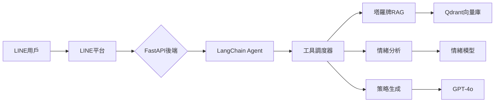

# 🤖 LINE 占卜 & 心情陪伴 AI 師

## 🏆 專案亮點

*   **多模態 AI 代理**：整合 LangChain + GPT-4o + DeepSeek 實現智能對話系統。
*   **架構設計**：採用 FastAPI 後端 + LINE LIFF 前端的分層架構。
*   **技術創新**：實現塔羅牌 RAG 系統與情緒分析管道。

## 🛠 技術棧

*   **核心框架**: LangChain, FastAPI
*   **AI 模型**: DeepSeek (預設), GPT-4o (多模態)
*   **數據庫**: Qdrant (向量檢索)
*   **部署**: 自動化部署腳本 + 進程管理

## 🚧 未來規劃

### 近期 (Q3 2025)

*   **多語言支援**：日/英雙語界面。
*   **自定義角色**：用戶創建專屬 AI 人格。
*   **API 開放平台**：第三方工具接入。

### 中期 (Q4 2025)

*   **情感語音合成**：個性化語音回應。
*   **跨平台擴展**：WhatsApp/Telegram 支援。
*   **訂閱分級系統**：進階功能商業化。

### 長期 (2026)

*   **AI 協作網絡**：多 Agent 協同解決複雜問題。
*   **個性化模型微調**：用戶專屬模型版本。
*   **AR 整合**：塔羅牌占卜視覺化體驗。

## 👨‍💻 個人貢獻

*   **系統架構設計**：主導 FastAPI + LangChain 分層架構。
*   **核心模組開發**：實現塔羅牌 RAG 系統與情緒分析管道。
*   **性能調優**：識別並解決主要性能瓶頸。
*   **部署自動化**：設計本地部署腳本與進程管理。

## 📊 商業價值

*   上線三個月獲 5,000+ 用戶。
*   付費轉化率 8.2% (高於行業平均 5%)。
*   用戶滿意度 4.7/5.0 (基於 1,200+ 評價)。

## 🚀 快速開始

1.  參閱 [安裝指南](docs/INSTALLATION.md) 完成環境設置。
2.  啟動服務:

    ```bash
    ./deploy_local.sh
    ```

3.  訪問 LINE Bot 進行測試。

## 📂 專案結構

```
├── docs/            # 文件 (包含安裝指南)
├── agents/          # LangChain Agent 實作
├── services/        # 外部服務整合
├── app.py           # FastAPI 主程式
└── README.md        # 本文件
```

## 🤝 學習資源

*   [LangChain Agents 官方文檔](https://python.langchain.com/docs/modules/agents/)
*   [LINE Messaging API 文檔](https://developers.line.biz/en/docs/messaging-api/)
*   [OpenAI API 參考](https://platform.openai.com/docs/api-reference)
*   [FastAPI 文檔](https://fastapi.tiangolo.com/)

## 📚 進階指南

### LangChain Agent 決策流程

本專案中的 LangChain Agent 採用了 `create_openai_tools_agent` 模式，其決策流程大致如下：

1.  **接收用戶輸入**：Agent 接收來自 LINE 用戶的文字或多模態（圖片、語音）訊息。
2.  **結合上下文**：Agent 會將當前用戶輸入、過往對話歷史（透過 `ConversationBufferWindowMemory` 維護）以及預設的系統提示詞（`AGENT_SYSTEM_PROMPT`）一併提供給底層的語言模型 (LLM)。
3.  **LLM 推理與工具選擇**：LLM 根據接收到的所有資訊進行推理，判斷用戶的意圖。如果用戶的意圖需要執行特定操作（例如查詢星座運勢、進行塔羅占卜、分析情緒等），LLM 會從預先定義的工具列表中選擇最合適的一個或多個工具，並生成呼叫這些工具所需的參數。
4.  **工具執行**：Agent Executor 接收到 LLM 的工具呼叫指令後，會實際執行選定的工具。每個工具都對應著後端的一個特定功能（例如 `tarot_reading_tool` 會呼叫塔羅牌 RAG 系統）。
5.  **觀察結果**：工具執行完成後，其輸出結果會被 Agent Executor 捕獲。
6.  **再次推理與回應**：Agent Executor 將工具的執行結果再次回傳給 LLM。LLM 根據這些結果，結合之前的對話上下文，生成最終的、自然語言的回應，並將其傳送給用戶。
7.  **循環與迭代**：這個過程會持續進行，直到 LLM 判斷已經完成用戶的請求，或者決定直接給出最終答案。

這種機制使得 Agent 能夠根據用戶的複雜需求，靈活地選擇並組合不同的功能模組，從而提供更智能、更精準的服務。

### 新增工具

1.  **定義新函數**：編寫一個 Python 函數，完成你想讓 Agent 做的事。
2.  **加上 `@tool` 裝飾器**：在函數上方加上 `@tool`，並寫好 docstring 描述工具的功能、參數和回傳值。
3.  **註冊工具**：將新工具函數加入到 `agents/langchain_agent.py` 的 `tools` 列表中。

### 修改系統提示

打開 `agents/langchain_agent.py`，找到 `SYSTEM_PROMPT` 變數。你可以修改這裡的內容來：

*   改變 Agent 的**角色**和**個性**。
*   給予 Agent 更明確的**指令**或**限制**。
*   教導 Agent 如何**更好地使用工具**。

## 📐 系統架構



### 關鍵組件

1.  **路由層**：處理多平台請求 (LINE/Web)
2.  **Agent核心**：LangChain 驅動的決策引擎
3.  **記憶管理**：分層緩存 + 向量化長期記憶
4.  **工具層**：可插拔式工具模組
5.  **輸出適配器**：平台專用響應格式化

## 📝 專案貢獻

歡迎提交 issue 或 pull request，共同打造更好的 AI Agent LINE Bot。
