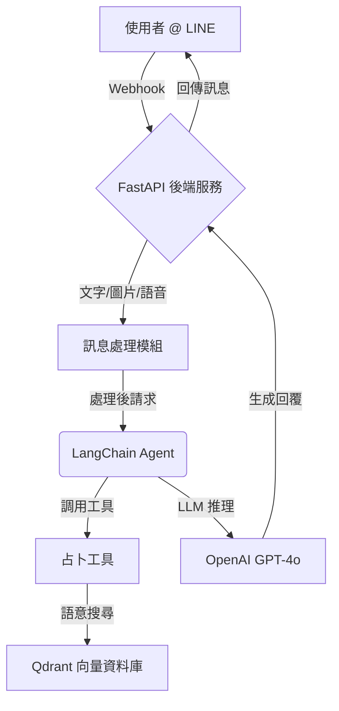

# 專案簡報：LINE 占卜 & 心情陪伴 AI 師

> **版本**：1.0
> **日期**：2025-07-04

---

## 1. 專案願景：您的專屬心靈夥伴

本專案旨在打造一個不止於回覆的 LINE 智慧夥伴。我們結合先進的 AI 技術，創造出一個能提供**塔羅占卜**、**傾聽心事**、並給予**溫暖陪伴**的 AI 師。

我們的目標是讓科技充滿溫度，在使用者需要指引或情緒支持時，成為最即時、最私密的依靠。

---

## 2. 核心功能

**多模態互動**
- **文字**：深度對話，解答疑惑。
- **圖片**：解讀圖像，提供洞見。
- **語音**：傾聽心聲，即時轉譯與回應。

**AI 占卜師**
- **塔羅抽牌**：隨機抽取塔羅牌，提供初步指引。
- **語意解析 (RAG)**：根據您的問題，從塔羅牌知識庫中找出最相關的牌義解讀，提供更個人化的分析。

**高度可擴展性**
- **工具整合**：基於 LangChain Agent 架構，能輕易整合天氣查詢、新聞摘要、知識庫檢索等多元工具。
- **API 串接**：架構清晰，易於串接更多第三方服務。

---

## 3. 技術架構

本專案採用現代化的技術棧，確保系統的穩定性與高效能：

- **後端框架**：`FastAPI` - 提供非同步、高效能的 API 服務。
- **AI 核心**：
    - `LangChain`: 作為 AI Agent 的主要框架，管理工具使用與邏輯鏈。
    - `OpenAI GPT-4o`: 強大的大型語言模型，負責生成自然、有深度的回應。
- **數據庫**：`Qdrant` - 高效能的向量數據庫，用於儲存塔羅牌義的向量，實現快速語意搜尋。
- **平台**：`LINE Messaging API` - 作為與使用者互動的前端介面。

---

## 4. 未來藍圖

- **個人化記憶**：讓 AI 師記住您的偏好與過去的對話，提供更貼心的服務。
- **情緒分析**：導入情緒偵測模型，更準確地理解您的狀態，給予最適切的回應。
- **主動關懷**：在特定時間或偵測到負面情緒時，主動發送關懷訊息。
- **知識庫擴充**：除了塔羅，未來將引入星座、易經、心理學等更多領域的知識。

---

**簡報完畢，謝謝。**
