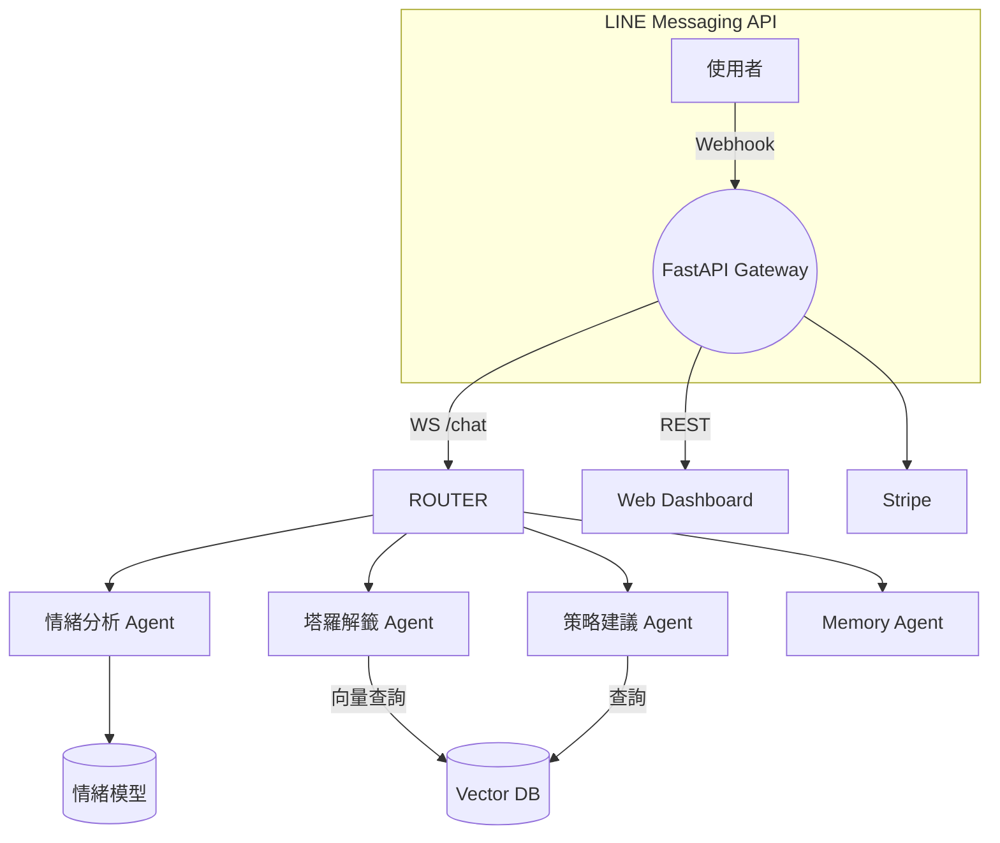

# LINE 占卜 & 心情陪伴 AI 師 — 架構文件

> **版本**：v0.2 · **最後更新**：2025-07-04
> **作者**：ROY / 系統化教練 ChatGPT

---

## 1. 產品概述

一款結合情緒分析、塔羅解籤與個人化人生建議的 LINE Bot，透過 **多代理 (Multi-Agent) + 進階 RAG** 與 **FastAPI** 後端，為用戶提供 24/7 的陪伴與行動指引，同時附帶「Prompt & Agent 微課程」作為商業延伸。

---

## 2. 目標用戶 & 價值主張

| 目標族群          | 核心痛點                 | 解決方案價值        |
| ------------- | -------------------- | ------------- |
| 文青、療癒／心靈成長愛好者 | 缺乏即時且可信的情緒支援         | 即時情緒偵測 + 溫柔建議 |
| 塔羅占卜興趣者       | 傳統占卜成本高、效率低          | 隨時抽牌，具引導性的解籤  |
| AI 興趣學習者      | Prompt / Agent 技能門檻高 | 附帶微課程與模板快速上手  |

---

## 3. 用戶流程 (Happy Path)

1. **加入好友** → Bot 自動發送歡迎與使用教學
2. **提出心情 / 問題** → 情緒分析 Agent 即時辨識
3. **選擇功能**

   * `/draw <n>`：塔羅抽牌
   * `/talk`：一般傾訴模式
4. **RAG 查詢 & 建議生成** (Streaming)
5. **行動建議 & 日記選單**
6. **週期性回顧推播** (可選)
7. **升級付費方案** (深度解析 / 1-on-1 指南)

---

## 4. 系統架構總覽



---

## 5. 後端服務 (FastAPI)

```text
POST /webhook            # LINE callback → 消息路由
WS   /chat                # Streaming 對話
GET  /rag/query           # RAG 查詢（向量 + re-ranker）
POST /memory/upsert       # 更新/寫入長期記憶
POST /tarot/draw          # 隨機出牌 + 解籤
```

---

## 6. Agent 編排

| Agent      | 角色       | 關鍵能力                                     |
| ---------- | -------- | ---------------------------------------- |
| **Router** | 任務分派     | 根據意圖切換到子代理                               |
| **情緒分析**   | NLP      | BERT/LLM + 情緒詞庫；輸出 (valence, arousal)    |
| **塔羅解籤**   | 占卜引擎     | 隨機選牌 → RAG 取牌義段落                         |
| **策略建議**   | 回覆生成     | 綜合牌義 + CBT 知識；產生 3-step 行動               |
| **Memory** | 使用者長短期記憶 | ConversationSummaryBufferMemory + Qdrant |

---

## 7. RAG 設計

* **知識來源**：

  * 78 張塔羅牌義 (正/逆位)
  * 心理諮商文章 \~150 篇
  * 認知行為療法 (CBT) 指南
* **Chunking 策略**：`SemanticChunker(256-512 tokens)`
* **向量模型**：`text-embedding-3-large`
* **檢索**：`Top-k (k=4) + LlamaIndex re-ranker`
* **回覆格式**：引用牌義出處 → 提升可信度

---

## 8. 資料存儲 & 記憶

| 資料類型      | 儲存層                            | 備註            |
| --------- | ------------------------------ | ------------- |
| 向量索引      | **Qdrant / Pinecone**          | 2 GB 預估       |
| 會話記憶      | **Redis** (近期) + Postgres (長期) | Hybrid Memory |
| Stripe 訂單 | Postgres                       | 付費升級記錄        |
| 使用者偏好     | Postgres JSONB                 | MBTI, 生日等     |

---

## 9. 技術棧

* **Backend**：Python 3.10 · FastAPI · LangChain/LangGraph · CrewAI
* **LLM Provider**：OpenAI GPT-4o (stream) + HuggingFace BERT
* **Vector DB**：Qdrant (Docker)
* **Observability**：Prometheus + Grafana；Sentry
* **CI/CD**：GitHub Actions → Vercel (Serverless) / Fly.io
* **Sec & Auth**：LINE Verify, JWT, Stripe Webhook Sig

---

## 10. 部署拓撲

```text
┌────────────┐      ┌──────────┐      ┌────────────┐
│   Client   │◀───▶│  Vercel  │◀───▶│ FastAPI GW │
└────────────┘      └──────────┘      └────────────┘
                                   │
                                   ▼
                         ┌───────────────────┐
                         │Qdrant (Vectors)   │
                         ├───────────────────┤
                         │Redis | Postgres   │
                         └───────────────────┘
```

---

## 11. 安全 & 隱私

1. **PII 打碼**：對話中偵測個資→遮蔽存儲
2. **OAuth2**：使用 LINE Login 取得用戶同意
3. **加密**：HTTPS / TLS 1.3；Postgres at-rest encryption
4. **合規**：ISO-27001 Hosting (Vercel/Fly)，GDPR DSR API

---

## 12. KPI & 監控

* 日活 DAU / 付費率 / 留存 (D1, D7, D30)
* 平均回覆延遲 < 2s (P95)
* RAG 回覆涵蓋率 > 90%
* Stripe MRR, Churn

---

## 13. Roadmap

| 時間      | 里程碑                               |
| ------- | --------------------------------- |
| 2025-Q3 | MVP 上線：Free + Plus 方案；塔羅 3 抽      |
| 2025-Q4 | Pro 方案；Web Dashboard；多語支援 (EN/JP) |
| 2026-Q1 | 聲音占卜 (TTS/STT)；擴充心理學內容庫           |
| 2026-Q2 | Marketplace：開放第三方牌卡 / 咒語模組        |

---

> **附件**：
>
> 1. `docs/api_spec.yaml` — OpenAPI schema
> 2. `infra/docker-compose.yaml` — 部署腳本
